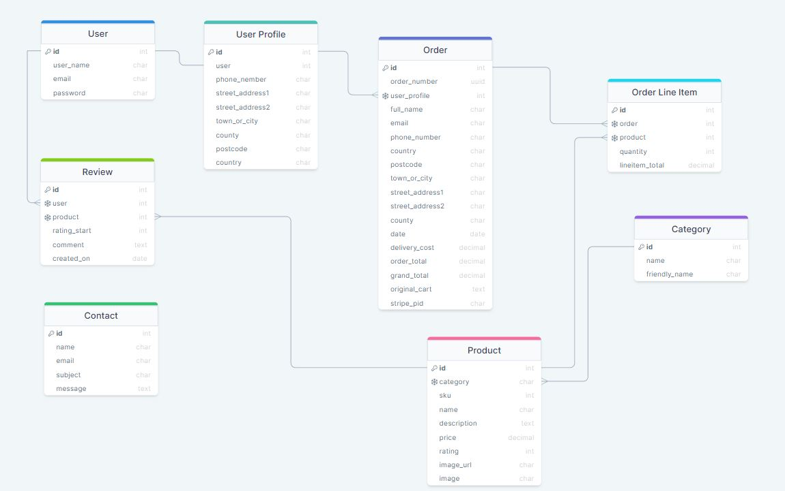

# MX Monster

## Project Overview

The MX Monster is a B2C e-commerce website for people interested in buying motorcycle clothing and accessories for their motorbikes.
The site provides a smooth online shopping experience for customers. The site processes online orders, provides an online secured payment method, and offers a fast delivery service.
The website allows users to use a search engine to find the most suitable product and, with just one click, add it to the shopping trolley.
The site is accessible across all devices using different browsers.
This website is fictional and was built for educational purposes only. No orders will be fulfilled.

## Primary Goal

The primary goal of the website, from the site owner’s perspective, is as follows:

- To enable customers to purchase products listed on the site
- To allow a user to navigate the website and view product details
- To allow a user to create an account & log in to an existing account
- To allow a user to view their order history and account details
- To allow users to keep updated with a newsletter signup
- To be able to edit, add and remove products from the site

The primary goal of the website, from a site user’s perspective, is as follows:

- To enable customers to purchase products listed on the site
- To allow a user to navigate the website and view product details
- To allow a user to create an account & log in to an existing account
- To view a list of all products of a chosen category
- To be able to search for a product
- To allow a user to view their order history and account details
- To allow users to keep updated with a newsletter signup
- To be able to edit, add and remove products from the basket
- To be able to use a secure payment method

## Target Audience

- Shopper looking to buy a motorcycle clothing
- Shopper looking to buy an aftermarket motorcycle equipment
- Shopper looking to buy motorcycle accessories

## User Requirements and Expectations

- The website is easy to navigate
- Easy to make a purchase
- No broken links
- Appropriate error handling
- Responsive and visually appealing on all device sizes
- Clear overview of all products/product groups
- The total purchase price is displayed on the screen
- Secure payment method
- CRUD functionality for products

## User Experience (UX)

### Shopper

- As a user, I want to view a list of all the products to choose items to purchase
- As a user, I want to see the products grouped in relevant categories to help me to narrow down the product I’m looking for
- As a user, I want to see individual product details to have a detailed explanation of the product along with the price
- As a user, I want to have contact information available to make contact with the store in case of any queries or problems
- As a user, I want to easily select the product(s) I want to purchase
- As a user, I want to see the items selected for purchase to keep track of my selections
- As a user, I want to see a running total of the shopping basket to keep track of my spending
- As a user, I want to select multiple quantities of the same product, to order two or more of the same products
- As a user, I want to filter the products to narrow down the products to the ones wanted
- As a user, I want to easily login and logout
- As a user, I want to register for an account
- As a user, I want to have my payment information saved to speed up the purchase process
- As a user, I want to have an option to recover my password if required
- As a user, I want to have a secure payment checkout
- As a user, I want to have an option to quickly search for a product I'm looking for
- As a user, I want to edit the basket content

### Store Owner

- I want an appealing website with a range of products
- I want shoppers to be able to read about the business
- I want shoppers to be able to navigate the site easily and quickly
- I want to be able easily to log in and log out to access personal information
- I want to be able to add a new product to the store
- I want to be able to edit/update a product price, description, images, and other information.
- I want to be able to delete a product that I no longer wish to sell.
- I want to be able to view all orders to determine which are completed and which are outstanding

### Error Handling

If the page cannot be loaded, the user should be able to return through the website's navigational structure without hitting the back button on their browser.

## Agile Methodology

Github issues were used to create the User stories and group them according to MoSCoW prioritization technique. Link to the project with live issues can be found [HERE](https://github.com/users/kwalczak80/projects/8/views/1)

## Wireframes-Desktop

- Home page
- Products page
- Products view
- Shopping bag
- Sign Up page
- Sign In page
- Contact page
- Newsletter page
- Newsletter Subscribe
- Newsletter Unsubscribe

## Wireframes-Tablet

- Home page
- Products page
- Products view
- Shopping bag
- Sign Up page
- Sign In page
- Contact page
- Newsletter page
- Newsletter Subscribe
- Newsletter Unsubscribe

## Wireframes-Mobile

- Home page
- Products page
- Products view
- Shopping bag
- Sign Up page
- Sign In page
- Contact page
- Newsletter page
- Newsletter Subscribe
- Newsletter Unsubscribe

## Site Map

The information architecture was organized in such a way as to ensure that users can navigate through the site easily.

## Structure

### Code structure

### Database design

The data schema was created using [drawsql](https://drawsql.app/)

