# MX Monster

## Project Overview

The MX Monster is a B2C e-commerce website for people interested in buying motorcycle clothing and accessories for their motorbikes.
The site provides a smooth online shopping experience for customers. The site processes online orders, provides an online secured payment method, and offers a fast delivery service.
The website allows users to use a search engine to find the most suitable product and, with just one click, add it to the shopping trolley.
The site is accessible across all devices using different browsers.
This website is fictional and was built for educational purposes only. No orders will be fulfilled.

## Primary Goal

The primary goal of the website, from the site owner’s perspective, is as follows:

- To enable customers to purchase products listed on the site
- To allow a user to navigate the website and view product details
- To allow a user to create an account & log in to an existing account
- To allow a user to view their order history and account details
- To allow users to keep updated with a newsletter signup
- To be able to edit, add and remove products from the site

The primary goal of the website, from a site user’s perspective, is as follows:

- To enable customers to purchase products listed on the site
- To allow a user to navigate the website and view product details
- To allow a user to create an account & log in to an existing account
- To view a list of all products of a chosen category
- To be able to search for a product
- To allow a user to view their order history and account details
- To allow users to keep updated with a newsletter signup
- To be able to edit, add and remove products from the basket
- To be able to use a secure payment method

## Target Audience

- Shopper looking to buy a motorcycle clothing
- Shopper looking to buy an aftermarket motorcycle equipment
- Shopper looking to buy motorcycle accessories

## User Requirements and Expectations

- The website is easy to navigate
- Easy to make a purchase
- No broken links
- Appropriate error handling
- Responsive and visually appealing on all device sizes
- Clear overview of all products/product groups
- The total purchase price is displayed on the screen
- Secure payment method
- CRUD functionality for products

## User Experience (UX)

### Shopper

- As a user, I want to view a list of all the products to choose items to purchase
- As a user, I want to see the products grouped in relevant categories to help me to narrow down the product I’m looking for
- As a user, I want to see individual product details to have a detailed explanation of the product along with the price
- As a user, I want to have contact information available to make contact with the store in case of any queries or problems
- As a user, I want to easily select the product(s) I want to purchase
- As a user, I want to see the items selected for purchase to keep track of my selections
- As a user, I want to see a running total of the shopping basket to keep track of my spending
- As a user, I want to select multiple quantities of the same product, to order two or more of the same products
- As a user, I want to filter the products to narrow down the products to the ones wanted
- As a user, I want to easily login and logout
- As a user, I want to register for an account
- As a user, I want to have my user details information saved to speed up the purchase process
- As a user, I want to have an option to recover my password if required
- As a user, I want to have a secure payment checkout
- As a user, I want to have an option to quickly search for a product I'm looking for
- As a user, I want to edit the basket content

### Store Owner

- As a user, I want an appealing website with a range of products
- As a user, I want shoppers to be able to read about the business
- As a user, I want shoppers to be able to navigate the site easily and quickly
- As a user, I want to be able easily to log in and log out to access personal information
- As a user, I want to be able to add a new product to the store
- As a user, I want to be able to edit/update a product price, description, images, and other information.
- As a user, I want to be able to delete a product that I no longer wish to sell.
- As a user, I want to be able to view completed orders from the customers.

## Error Handling

If the page cannot be loaded, the user should be able to return through the website's navigational structure without hitting the back button on their browser.

## Agile Methodology


Github issues were used to create the User stories and group them according to MoSCoW prioritization technique. Link to the project with live issues can be found [HERE](https://github.com/users/kwalczak80/projects/8/views/1)

## Wireframes-Desktop

- [Home page](docs/wireframes/desktop/home-page-desktop.png)
- [Products page](docs/wireframes/desktop/products-page-desktop.png)
- [Product view](docs/wireframes/desktop/product-view-page-desktop.png)
- [Shopping bag](docs/wireframes/desktop/shopping-bag-page-desktop.png)
- [Checkout page](docs/wireframes/desktop/checkout-page-desktop.png)
- [Order confirmation page](docs/wireframes/desktop/order-confirmation-page-desktop.png)
- [Sign Up page](docs/wireframes/desktop/sign-up-page-desktop.png)
- [Sign In page](docs/wireframes/desktop/sign-in-desktop.png)
- [User profile](docs/wireframes/desktop/user-profile-page-desktop.png)
- [Privacy Page](docs/wireframes/desktop/privacy-page-desktop.png)
- [Terms and Conditions page](docs/wireframes/desktop/terms-page-desktop.png)
- [FAQ page](docs/wireframes/desktop/faq-page-desktop.png)
- [Newsletter page](docs/wireframes/desktop/newsletter-page-desktop.png)
- [Newsletter Subscribe](docs/wireframes/desktop/newsletter-subscribe-page-desktop.png)
- [Newsletter Unsubscribe](docs/wireframes/desktop/newsletter-unsubscribe-page-desktop.png)
- [Contact page](docs/wireframes/desktop/contact-page-desktop.png)
- [About page](docs/wireframes/desktop/about-page-desktop.png)

## Wireframes-Tablet

- [Home page](docs/wireframes/tablet/home-page-tablet.png)
- [Products page](docs/wireframes/tablet/products-page-tablet.png)
- [Product view](docs/wireframes/tablet/product-view-page-tablet.png)
- [Shopping bag](docs/wireframes/tablet/shopping-bag-page-tablet.png)
- [Checkout page](docs/wireframes/tablet/checkout-page-tablet.png)
- [Order confirmation page](docs/wireframes/tablet/order-confirmation-page-tablet.png)
- [Sign Up page](docs/wireframes/tablet/sign-up-page-tablet.png)
- [Sign In page](docs/wireframes/tablet/sign-in-page-tablet.png)
- [User profile](docs/wireframes/tablet/user-profile-page-tablet.png)
- [Privacy Page](docs/wireframes/tablet/privacy-page-tablet.png)
- [Terms and Conditions page](docs/wireframes/tablet/terms-page-tablet.png)
- [FAQ page](docs/wireframes/tablet/faq-page-tablet.png)
- [Newsletter page](docs/wireframes/tablet/newsletter-page-tablet.png)
- [Newsletter Subscribe](docs/wireframes/tablet/newsletter-subscribe-page-tablet.png)
- [Newsletter Unsubscribe](docs/wireframes/tablet/newsletter-unsubscribe-page-tablet.png)
- [Contact page](docs/wireframes/tablet/contact-page-tablet.png)
- [About page](docs/wireframes/tablet/about-page-tablet.png)

## Wireframes-Mobile

- [Home page](docs/wireframes/mobile/home-page-mobile.png)
- [Products page](docs/wireframes/mobile/products-page-mobile.png)
- [Product view](docs/wireframes/mobile/product-view-page-mobile.png)
- [Shopping bag](docs/wireframes/mobile/shopping-bag-page-mobile.png)
- [Checkout page](docs/wireframes/mobile/checkout-page-mobile.png)
- [Order confirmation page](docs/wireframes/mobile/order-confirmation-page-mobile.png)
- [Sign Up page](docs/wireframes/mobile/sign-up-page-mobile.png)
- [Sign In page](docs/wireframes/mobile/sign-in-page-mobile.png)
- [User profile](docs/wireframes/mobile/user-profile-page-mobile.png)
- [Privacy Page](docs/wireframes/mobile/policy-page-mobile.png)
- [Terms and Conditions page](docs/wireframes/mobile/terms-page-mobile.png)
- [FAQ page](docs/wireframes/mobile/faq-page-mobile.png)
- [Newsletter page](docs/wireframes/mobile/newsletter-page-mobile.png)
- [Newsletter Subscribe](docs/wireframes/mobile/newsletter-subscribe-page-mobile.png)
- [Newsletter Unsubscribe](docs/wireframes/mobile/newsletter-unsubscribe-page-mobile.png)
- [Contact page](docs/wireframes/mobile/contact-page-mobile.png)
- [About page](docs/wireframes/mobile/about-page-mobile.png)

## Site Map

The information architecture was organized in such a way as to ensure that users can navigate through the site easily.


## Structure

### Code structure

The project is organized into various applications, as constructed using the Django Framework. App details are as follows:

- **Bag** - this app is for users where they can view, add and remove products that they have added to the bag.
- **Checkout** - this app is for users to purchase selected items. Users can see items in the cart and have the option to save delivery information to their profile during the checkout process.
- **Contact** - this app is for users to be able to contact MX Monster and recieve acknowledgment.
- **FAQ** - this app is for the business owner to manage content of the frequently asked questions page from the admin panel.
- **Home** - this app contains information about the MX Monster home page with quick links in the header.
- **Newsletter** - this app is for users to subscribe to or unsubscribe from a newsletter.
- **Products** - this app contains information related to the products displayed on the website. Users can add items to a shopping cart, filter for items in categories, and view the results of the product search. Clicking on individual items opens a sub-page where users can see detailed product information. The logged-in staff members have the following options:
  - add a new product for sale,
  - update an existing product,
  - delete product that is no longer for sale
- **Profiles** - this app contains information related to the user profiles.
- **Reviews** - this app is for users to add their reviews related to the products. Logged-in users can edit or delete their own reviews. The business owner can manage reviews posted by the shoppers in the admin panel.
- **Staff** - this app is for the business owner to manage MX Monster staff in the admin panel. Thanks to this app information about the staff members is dynamically displayed on the page. Information about the team is pulled from the database; it is not hard-coded in HTML.

To complement the apps there are:

- **Mx Monster**: Mx Monster level files - settings.py for project level settings and urls.py to route the website urls.
- **Templates**: Containing the base.html, allauth(django authentication). The partial folder contains the navbar and footer HTML.
- **Templates** (app level): some of the apps have their own templates directory for HTML to consider portability and reuse.
- **Urls (app level)**: each app has its own urls.py file to consider portability and reuse.
- **Static**: CSS files for the website and admin panel.
- **manage.py**: This file is used to start the site and perform functions during development.
- **README.md**: Documentation about the project.
- **Requirements.txt**: Containing the project dependencies. Note: Environment variable values are not exposed in the source code as they are stored locally in env.py that is not checked in(listed in .gitignore).
- **Procfile**: To run the application on Heroku
- **custom_storages.py** file - to specify static and media storage location

### Database design

The data schema was created using [drawsql](https://drawsql.app/)

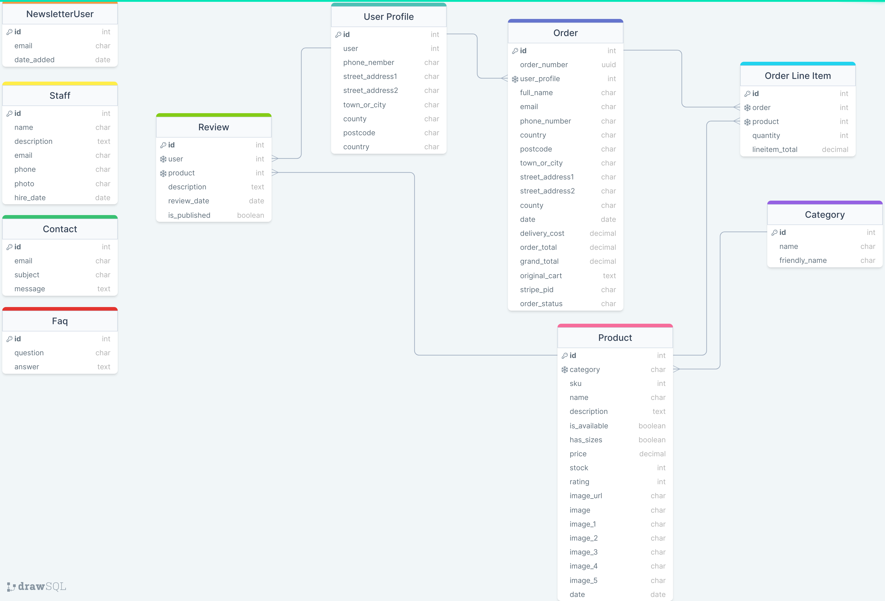

## Models

The following models were created to represent the database model structure for the website:

### Order model

| Name | Key | Type | Other Details |
| -- | -- | -- | -- |
| order_number | | CharField | max_length=32 |
| user_profile | UserProfile | ForeignKey | |
| full_name |  | CharField | max_length=50 |
| email |  | EmailField | max_length=254 |
| phone_number |  | CharField | max_length=20 |
| country |  | CountryField | blank_label='Country *' |
| postcode |  | CharField | max_length=20 |
| town_or_city |  | CharField | max_length=40 |
| street_address1 | | CharField | max_length=80 |
| street_address2 | | CharField | max_length=80 |
| county |  | CharField | max_length=80 |
| date |  | DateTimeField | auto_now_add=True |
| delivery_cost |  | DecimalField | max_digits=6 |
| order_total |  | DecimalField | max_digits=10 |
| grand_total |  | DecimalField | max_digits=10 |
| original_bag |  | TextField | default='' |
| stripe_pid |  | CharField | max_length=254 |

### OrderLineItem model

| Name | Key | Type | Other Details |
| -- | -- | -- | -- |
| order | Order | ForeignKey | |
| product | Product | ForeignKey | |
| product_size | | CharField | max_length=2 |
| quantity | | IntegerField | default=0 |
| lineitem_total | | DecimalField | max_digits=6 |

### Contact model

| Name | Key | Type | Other Details |
| -- | -- | -- | -- |
| email | | EmailField | |
| subject | | CharField | max_length=255 |
| message | | TextField | |

### Faq model

| Name | Key | Type | Other Details |
| -- | -- | -- | -- |
| question | | CharField | Max length=254 |
| answer | | TextField | blank=True |

### NewsletterUser model

| Name | Key | Type | Other Details |
| -- | -- | -- | -- |
| email | | EmailField | |
| date_added | | DateTimeField | Set default date as now |

### Product model

| Name | Key | Type | Other Details |
| -- | -- | -- | -- |
| category | Category | ForeignKey | |
| sku | | CharField | max_length=254 |
| name | | CharField | max_length=254 |
| description | | TextField |  |
| is_available | | BooleanField | default=True |
| has_sizes | | BooleanField | default=False |
| price | | DecimalField | max_digits=6, decimal_places=2 |
| stock | | IntegerField | default=100 |
| rating | | DecimalField | max_digits=6, decimal_places=2 |
| image_url | | URLField | max_length=1024 |
| image | | ImageField |  |
| image_1 | | ImageField |  |
| image_2 | | ImageField |  |
| image_3 | | ImageField |  |
| image_4 | | ImageField |  |
| image_5 | | ImageField |  |

### Category model

| Name | Key | Type | Other Details |
| -- | -- | -- | -- |
| name | | CharField | max_length=254 |
| friendly_name | | CharField | max_length=254 |

### UserProfile model

| Name | Key | Type | Other Details |
| -- | -- | -- | -- |
| user | | User | OneToOneField |
| default_phone_number | | CharField | max_length=20 |
| default_street_address1 | | CharField | max_length=80 |
| default_street_address2 | | CharField | max_length=80 |
| default_town_or_city | | CharField | max_length=40 |
| default_county | | CharField | max_length=80 |
| default_postcode | | CharField | max_length=20 |
| default_country | | CountryField | blank_label='Country' |

### Review model

| Name | Key | Type | Other Details |
| -- | -- | -- | -- |
| user | User | ForeignKey |  |
| product | Product | ForeignKey | |
| description | | TextField | Set default as ''|
| review_date | | DateTimeField | Set default date as now |
| is_published | | Boolean | default=False |

### Staff model

| Name | Key | Type | Other Details |
| -- | -- | -- | -- |
| name | | CharField | Max length 100 Set default as '' |
| description | | TextField | Set default as ''|
| email || CharField | Max length 50 |
| phone || CharField | Max length 50 |Set default as ''|
| photo || ImageField ||
| hire_date || DateTimeField | Set default date as now |

## Design Choices

### Home page background

As the background of the main page, I used a photo of a motorcycle with proper accessories and a motorcyclist wearing clothing. The photo represents the store's theme nicely, in my opinion.


### Fonts

I visited the Google fonts website to explore the available font options for my project. After consideration, three different font types were chosen to be used in different sections of the website.

- The [Anton](https://fonts.google.com/specimen/Anton?query=anton) font is used in the navigation bar and to display the business name.
- The [Michroma](https://fonts.google.com/specimen/Michroma?query=michroma) font is used to display text information in the footer links.
- The [Varela Round](https://fonts.google.com/specimen/Varela+Round?query=varela) font is used to display all other text information.

### Colours

I used [Coolors](https://coolors.co/) to come up with a color scheme. The color palette was intended to create a fairly neutral background so that the photos of the products stand out as much as possible.

- gradient (#f30606, #b12020, #030303) - the business name displayed on the navigation bar
- #f1f1f1 - the website background color
- #ffffff - the cards background color
- #212529 - footer and free delivery banner background color
- #b31212 - hover effect color
- #ffac0c - text color on the business opening times card
- #FFC107 - text color displayed on the home page carousel


### Icons

All the icons that are used in this project come from the [Font Awsome](https://fontawesome.com/) website.

### Search


### My account


### Bag shopping cart


### Edit review


### Delete review


## Features

### Responsive design

The website has been designed using Bootstrap 4 therefore it's fully responsive on all screen sizes.

### Homepage

The home page is a simple set of navigation elements, a background image, and a carousel that displays shop now, contact and newsletter subscription options.

A shop now button directs the user to the “All products” page, where they can easily identify products they would like to purchase. The product list displayed on this page is always ordered by date added, i.e., the latest products added for sale by the shop admin will be displayed at the top of the page.

A contact button directs the user to the page with the contact form that is used to contact the customer service team in case of any queries that the customer may have.

A Subscribe button directs the user to the page where they can subscribe to the newsletter to receive information about new products, special offers, discounts, etc.

A Facebook button directs the user to the shop's Facebook page.


### Navigation menu

The following navbar structure is available on the medium and large screens:

- MX Monster - the business name displayed on the navigation bar
- Search window - is used to search the entire shop for a specific product
- My account  - to display information about the user account
- Basket - to display information about the products in the basket
- All products - link to the page with all products for sale
- Riding gear - link to the Riding gear page
- Vehicle equipment - link to the  vehicle equipment page
- Accessories - link to the accessories page
- Special Offers - link to the special offers page


The following navbar structure is available on the small screens:

- Search window - is used to search the entire shop for a specific product
- My account  - to display information about the user account
- Basket - to display information about the products in the basket


The hamburger menu contains the following links:

- Home - link to the home page
- All products - link to the page with all products for sale
- Riding gear - link to the Riding gear page
- Vehicle equipment - link to the  vehicle equipment page
- Accessories - link to the accessories page
- Special Offers - link to the special offers page


Depending on whether the user is logged in or not, different options are available in the Main account menu.

- For the user that is not logged in or registered, the following options are available:
  - Register - the user will be redirected to the registration page
  - Login - the user will be redirected to the login page


- For the user that is logged in, the following options are available:
  - My profile - the user will be redirected to the My profile page where they can update their profile information and view order history
  - Logout - the user will be redirected to the logout page


- For the admin site user that is logged in, the following options are available:
  - Product management - the user will be redirected to the page where they can manage products displayed on the page(add, edit or delete)
  - My profile - the user will be redirected to the My profile page where they can update their profile information and view order history
  - Logout - the user will be redirected to the logout page


### Search bar


The search bar is part of the header and appears across all pages. This allows the user to easily search for products by typing in the keywords.
The user can either enter a single keyword to find a product or enter multiple keywords, as this type of search functionality is also supported.

### Products page

When the user clicks on the **Shop now** button on the home page or the **All products** link from the All products dropped down menu in the navigation bar, they will be redirected to the page where they can view all the products that are available for sale.
By default, all the products displayed on this page are ordered by the date they were added to the database (i.e., the latest products added for sale will be displayed first).


From the **All Products** drop-down menu, the user can also choose the option to specify how the products are displayed on the screen:

- by price(by default price from low to high)
- by rating(by default high to low)
- by category(by default A-Z)


The user also has the option to select the order in which to view the products listed. They can order:

- by price (low to high)
- by price (high to low)
- by rating (low to high)
- by rating (high to low)
- by name (A-Z)
- by name (Z-A)
- category (A-Z)
- category (Z-A)


Once the user clicks on the product image, they will be redirected to a page where additional information about the specific product will be presented.

### Product details page

When the user is interested in a specific product and clicks on the product image, they will be redirected to a page where they can find additional information about the product. This page is divided into sections:

#### The product image section

The product main photo - presents the product image. Once the image is clicked, the product photo will be opened in a new tab.

#### The product infromation section

Additional information about the product is presented by using Font Awsome icons and text. This section contains:

- The name of the product
- The product price
- The product category
- The product rating
- The product description
- Option to select the product size. The following size options are available from the drop-down menu (XS, S, M, L, XL). Please note that if the product does not have a size, i.e., the navigation system, the size option will not be visible on the screen.
- Quantity - to select the number of products the user wants to buy
- The **Keep shopping** button to redirect the user to the all products page
- The **Add to bag** button to add the specific product to the shopping bag

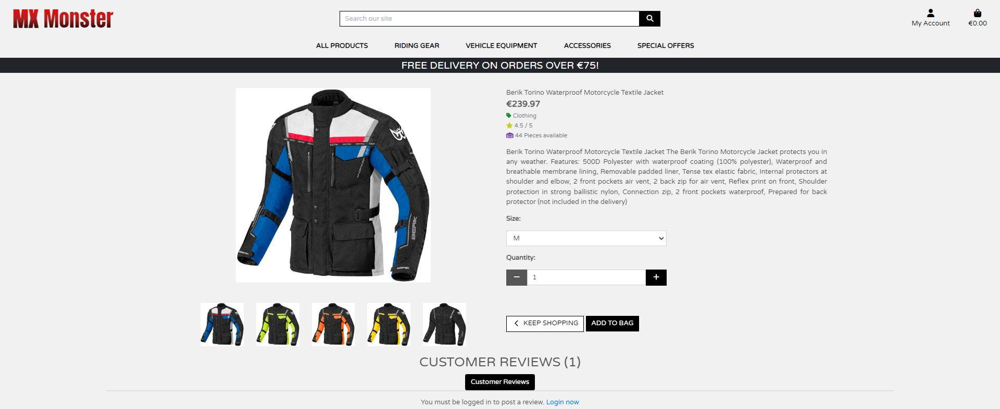

If the product is out of stock then the **Add to bag** button and the product quantity field are hidden.

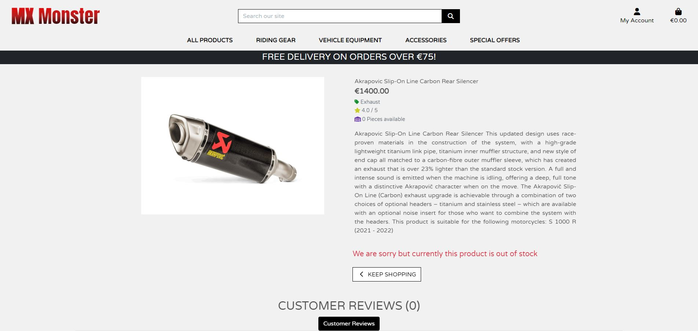

#### The product reviews section

The user can also read the customer reviews about the product to help them decide if it is worth buying.
The number (other than zero) inside the customer review brackets indicates that the product has reviews from other customers.
To read the reviews of the product, the user needs to click on the **Customer Reviews** button.


If the user is logged in, the button to **Add Review** will also be visible.


The user can add a new review by clicking on the **Add Review** button.
The user will be redirected to the page where they can add a new review of the product.


The user can also edit or delete existing reviews (CRUD functionality). Please note that logged-in users can only manage reviews they have written.
When a user clicks the edit icon, they are taken to a page where they can edit the review they previously created.
Please note that the description section contains the current review description pulled from the database.
Once the review is updated, a confirmation message will be displayed on the screen. Please read about the message system below.


The user can also delete the review they created by clicking on the bin icon.


Once the review is deleted, a confirmation message will be displayed on the screen. Please read about the message system below.

### Product management

When the user is logged in as a staff or admin they can select **Product Management** option by clicking on the **My account** link.


They will be redirected to a new page where they can add a new product for sale.

The panel contains the following fields:

- Category - from the drop-down menu, the user can select the product category. All the categories presented in the database will be listed here.
- SKU - a number to differentiate products and track inventory levels
- Product name - this is a mandatory field
- Product description - this is a mandatory field
- is available - selected by default. If the "is available" option is selected, that means the product will be visible on the page.
- has sizes - default - "NO".
- Price(mandatory field)
- Stock(mandatory field)
- Rating
- Image url
- **Select image** button - to upload relevant product image
- **Add product** button - once clicked; a new product will be added to the database(only if all fields are correct)


When the user is logged in as a staff user or admin, they have the ability to update or delete the selected product as the edit and delete options become available on the product card.

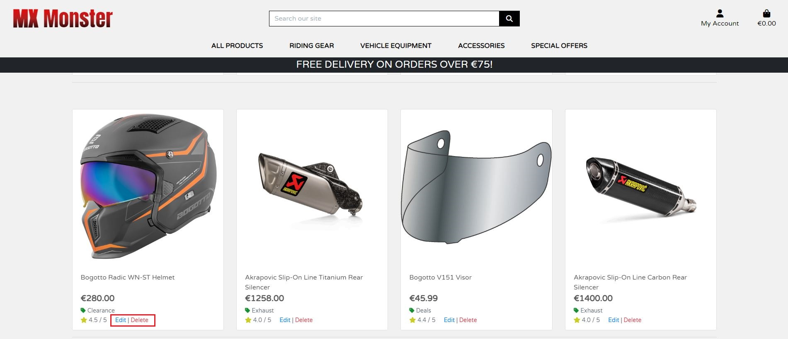

If the **Edit** option is clicked the user will be redirected to a new page where they can edit the product information including the product image.


If the **Delete** option is clicked the product will be deleted from the database.

### User profile page

In order to open the user profile page, the user must first click on the **My Account** link located in the navbar and then click on the **My profile** link.


The form for updating the user's delivery information is displayed on this page. If the consumer returns to the checkout page after completing the form, all shipping data will be instantly updated.

By selecting the order number from the list, the user can view the order history. If the order is completed, the user will be alerted with a message indicating they are viewing a past order summary.

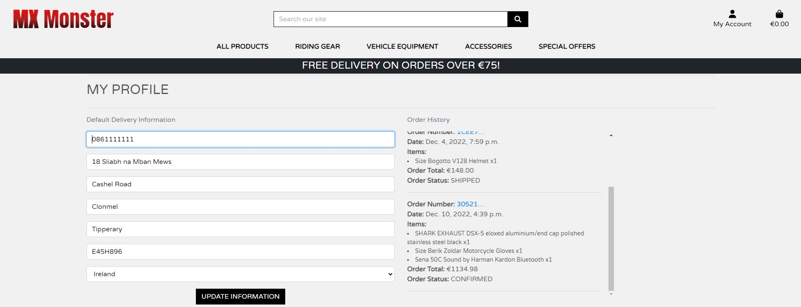

### Shopping bag

When the shopping bag is empty, the bag icon is black; when an item is added to the bag, the bag icon turns red to indicate that some products have been added.


If the user clicks on the bag icon, they will be redirected to the page where they can review the bag content. At this stage, some adjustments to the bag are possible:

- change the product quantities
- remove the product from  the shopping bag if the product is no longer required


If the user clicks on the **Secure checkout** button, they will be redirected to the page where they can complete the payment process.

### Checkout page

- The user is prompted to enter their delivery information on a checkout form. that integrates Stripe.
- A checkbox that the user can confirm allows them to save their delivery information for the next time.
- An order summary will be shown before the user can complete the checkout process so they can confirm the total cost and view all goods.

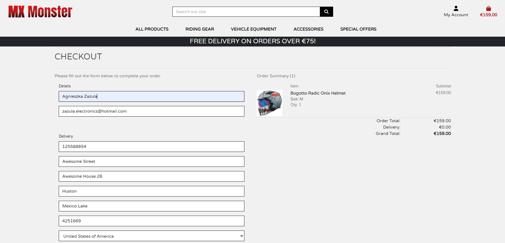

To inform the user that their credit card will be charged a specified amount, a message is displayed immediately beneath the button labelled "Complete Order."


Once the payment process is completed a confirmation message will be displayed on the screen and a confirmation email will also be sent to the user.


### Privacy page

The user can access information about MX Monster's privacy policy from the footer by clicking on the **Privacy** link.
The privacy document explains how MX Monster handles any customer information gathered in its operations.


### Terms and conditions page

The user can access information about MX Monster's terms and contitions from the footer by clicking on the **Terms** link.
The Terms and conditions document set the way in which the product, service or content may be used, in a legally binding way.


### Frequently asked quastions page

The Frequently Asked Questions page can be accessed from the footer by clicking on the **FAQ** link.
On this page, the user can find answers to the most commonly asked questions.


Once the user clicks on the question the answer will be automatically revealed(accordion functionality)


The business owner can edit the question and set status to published so the question is displayed for the public includng the answer.


If all the **is_published** boxes are deselected the relevant message will be displayed on the screen.


### Newsletter

The newsletter link appears on the footer, to make it as visible as possible and encourage the user to sign up for the newsletter.
Once the user clicks on the **Newsletter** link, the newsletter page will be displayed.
On this page, the user has two options:

- Subscribe to a newsletter
- Unsubscribe from a newsletter(if already subscribed)


If the user clicks on the **Subscribe** button, they will be redirected to the newsletter subscription page.
In order to subscribe to a newsletter, the user has to provide their email address and click on the **Subscribe** button.
The **Back** button will redirect the user back to the main newsletter page.


If the user clicks on the **Unsubscribe** button, they will be redirected to the unsubscription page.
In order to unsubscribe from a newsletter, the user has to provide their email address and click on the **Unsubscribe** button.
The **Back** button will redirect the user back to the main newsletter page.


If the user has subscribed to or unsubscribed from a newsletter, the relevant message will be displayed on the screen.
See the messages section for more details.

### Contact page

The contact page contains a form that any user can complete to enable them to contact the business in case of any queries.
This page also contains information about the business's opening hours and its address.
The current day of the week on the business's opening hours card is highlighted thanks to a special Java script.

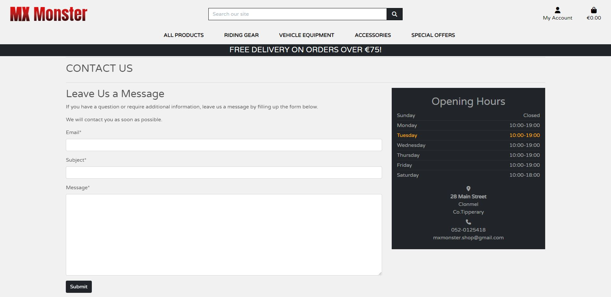

### About page

On the About page, the user can view information about MX Monster's business. The content in this section can help build customer trust and encourage customers to buy products from the site.


This page also includes a section with contact information for people who are running the business.


### Authentication

The authentication process for the application is handled by Django allauth and consists of three parts.

#### Sign Up


If the user entries are wrong, the relevant error message will be displayed on the screen, informing what needs to be corrected to complete the registration process.


#### Sign In

The sign-in form requires only two fields to be entered.

- Username
- Password


If the user name or password is incorrect, an error message will be shown on the screen.


#### Sign out

If the user decides to log out, they will be redirected to the page to confirm their choice.


### Messages system to provide feedback to the user

Messages are displayed on the screen to provide the user with continuous feedback on their interactions. Some examples can be seen below:


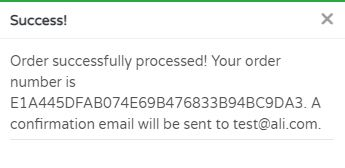

### Error handling

#### 400 page

This page was created to handle the situation when the server cannot or will not process the request due to something that is perceived to be a client error.
A relevant message will be displayed on the screen if this situation occurs.

#### 403 page

This page was created to handle the situation when the server understands the request but refuses to authorize it.
A relevant message will be displayed on the screen if this situation occurs.

#### 404 page

If the page the user is trying to reach is not accessible, the following error message will be displayed on the screen. The user can return to the home page by pressing the home button. There is no need to hit the back button on the browser.

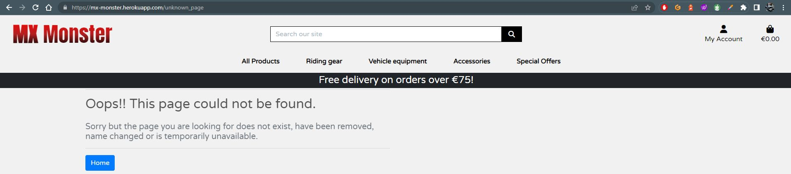

#### 500 page

A 500 server error page was also created to handle internal server errors.


### Footer

The footer is kept very simple as a set of links to other pages and social channels.
The following links are presented in the footer:

- Privacy - link to the page where the user can read about the privacy policy
- Terms - link to the page where the user can read about the terms and conditions
- FAQ - link to the page where the user can find the answers to the most common questions asked by the other users
- social media channels(Facebook, Instagram, Twitter) - link to the social channels
- Newsletter - link to the page where the user can subscribe to the newsletter
- Contact - link to the page with the contact form
- About - link to the page where the user can read more about the MX Monster business


The footer layout changes depending on the screen size.


A hover effect is implemented if the user hovers over the footer links.


Please note that the footer is displayed only on selected pages.

### Customized Admin (the business owner) panel

The admin panel was adjusted with the following changes:

- the name of the business is now displayed on the top bar
- the color scheme was slightly changed
- the color of some buttons was changed

The changes above are only cosmetic, but thanks to that, the panel looks a little bit different than the standard Django panel.


The Django admin panel is a built-in tool that allows admin users to create, view, update, and delete records. This is a very useful tool to manipulate all the data tables in one place.
Some examples of how it can be used are shown below.

#### Admin panel - ability to select products that will be displayed on the page

This feature allows the business owner to enable or disable the product's visibility on the website. There is no need to delete the product from the database if, for some reason, the business owner does not want it to be displayed on the website (i.e., the product is sold out or temporarily unavailable).


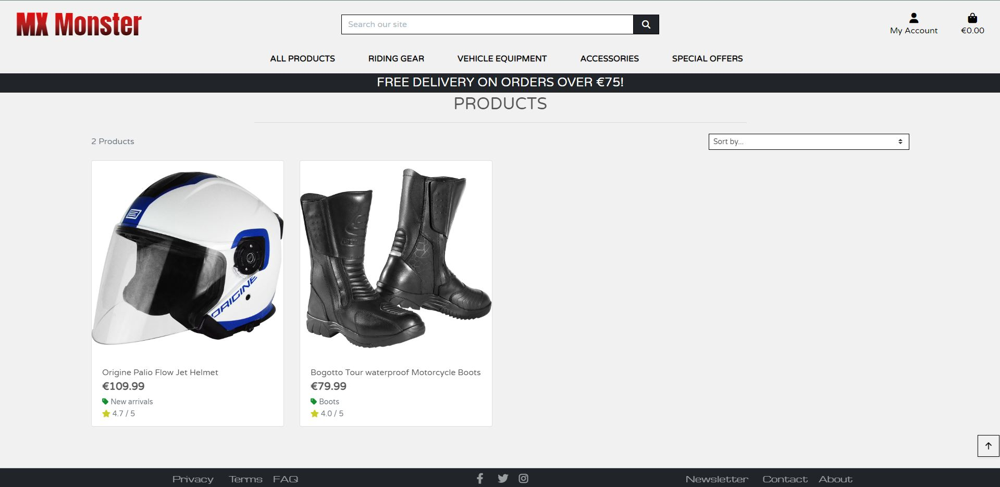

#### Admin panel - ability to add a new employee

The business owner can add a new employee via the admin panel. All the information about the staff(photo, name, email, etc.) that is displayed on the website(the About page) comes from the database, and it's not hard coded in HTML. Therefore, in the event of any changes(i.e. new employee), the updated information will be automatically displayed on the website.


#### Admin panel - ability to review orders


#### Admin panel - ability to review messages sent by the customers


### Admin panel - ability to approve product reviews

The registeed user can add the product review, however it will be displayed on the page upon the businnes approval.
All new reviews are not published by default.

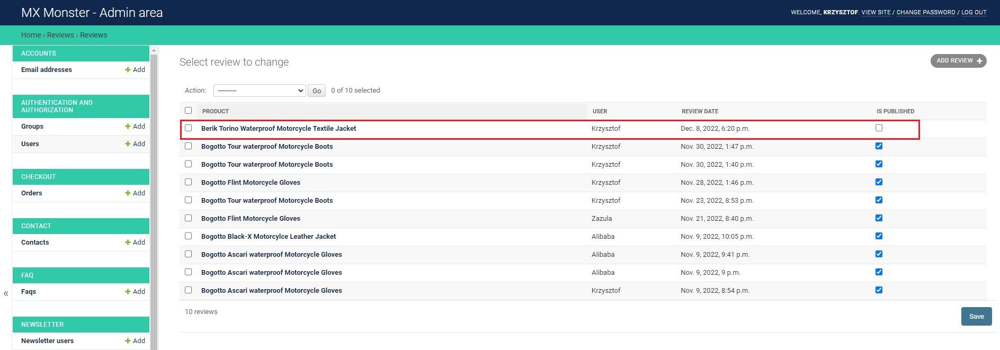


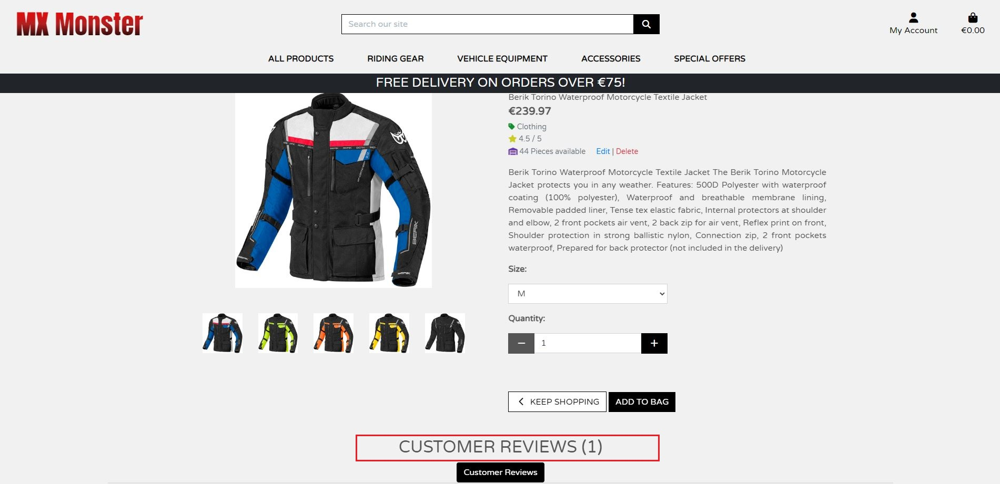

## SEO - Search Engine Optimization

To improve the Search Engine Optimization (SEO) of the site the keywords were researched using [WordTracker](https://www.wordtracker.com/) to optimize web pages and content to increase ranking in search engines.
The keyword research was used for both short-tail & long-tail keywords.


## Marketing

As part of marketing strategies for the MX Monster Store, I decided to use social media, and email marketing. All options are free, but effective for an e-commerce store.

### Facebook Business Page

- A Facebook business page was the chosen platform, to help build relationships and loyalty with customers. This can be achieved by posting frequent updates to the site, promoting the items, and having direct interactions with existing and potential customers. The next steps would include using Twitter, Instagram, and YouTube as social media platforms to target a larger audience.

Facebook site can be viewed [here](https://www.facebook.com/profile.php?id=100088407152747)

### Email marketing(Newsletter)

- I've opted to create a custom newsletter model and not use Mailchimp. A newsletter is another free source of marketing, whereby by using email subscriptions, users would receive a newsletter, outlining current items in the store, sales, discounts, and any other information related to the business. This is a straightforward way to increase sales and have customers return by providing discounts.

## Bugs

<details>
<summary>Success toast was not displaying correctly</summary>

I have omitted in error to loop through the messages


Fix


        <div class="message-container">
            
        </div>

</details>

<details>
<summary>Unable to display the toast message after bag adjustment</summary>


Fix

Add get_object_or_404 as it was not included in error.
</details>

<details>
<summary>Authentication error at checkout</summary>


Fix

Despite the fact that the public and secret keys were added to the gitpod variables I had to add the also to the env file.

</details>

<details>
<summary>Unable to run the website on the localhost(desktop)</summary>


Fix

Clear the session cookies. When using the laptop I deleted some products from the database. Deleted items no longer existed in the database but were still presented in the basket. This issue was causing an error.
</details>

<details>
<summary>Failed to deploy to Heroku</summary>


Issue: Original Proc file web: gunicorn mx-monster.wsgi:application (incorrect appication name)

Fix: Original Proc file web: gunicorn mx_monster.wsgi:application

</details>

<details>
<summary>Unable to display privacy page</summary>


Fix: Add missing  tag

</details>

<details>
<summary>Issue with displaying product categories after implementation of pagination</summary>

After pagination was implemented, the products did not display correctly on the screen when selecting any category.
All products were displayed on the screen, regardless of which category was selected.


Fix: Add the following code within the if request.GET statement:

`paginator = Paginator(products, 12)`

`page = request.GET.get('page')`

`paged_products = paginator.get_page(page)`


</details>

<details>
<summary>Images displayed on cards had no equal height.</summary>


Fix: The fix was implmented by adding the following card-img-top class in the style.css file

'''
.card-img-top {
    width: 100%;
    height: 15vw;
    object-fit: contain;
}
'''


</details>

<details>
<summary>The user was able to enter negative product quantity or enter more items than available in stock. This was possible after the HTML code manipulation.</summary>


Fix : The product quantity validation entered by the user was implemented in the python code. See more details in the section below.
</details>

<details>
<summary>Following the implementation of the lightbox gallery functionality, the product details page is unable to be displayed.</summary>

This issue occurred on all the pages where the product has no thumbnail images.


Fix : Add if statement to check if the thumbnail image(s) exist in the database.

``` Django

<div class="col-md-2">
    <a href="{{ product.image_1.url }}" data-toggle="lightbox" data-gallery="img-gallery"
        aria-label="Product photo 1" data-height="560" data-width="560">
        
    </a>
</div>

```

</details>

## Product quantity validation

During testing of the MX Monster Store functionality, I discovered a critical bug that allows the user to bypass the minimum and maximum values ​​when entering the product quantity that can be added to the basket. This could be done by removing or adjusting the min and max values.


After removing min and max values, I was able to enter negative product quantities as well as quantities that exceeded the product stock value.


After the implementation of the product quantity validation, the relevant message will be displayed on the screen if the user enters a product quantity that exceeds the product stock.
Even if the HTML code is manipulated (max value), the product quantity validation will handle all exceptions.


The minimum value is set to "1" in the HTML code, so the user cannot enter a negative quantity.


However, if the HTML code is manipulated (the minimum value is deleted or changed), a relevant message will be displayed on the screen as the product quantity validation will handle this exception.


## UX Testing

| User requirements | Implemented | Tested | Comments
| ------------ | ----------- | ------ | --------
| As a user, I want to view a list of all the products to choose items to purchase |Yes|Yes| On the All Products page, the user can view a list of all products available for sale.
| As a user, I want to see the products grouped in relevant categories to help me to narrow down the product I’m looking for |Yes|Yes| In the navigation bar, the user can find links to products divided into individual categories. The description of the categories is very clear, which helps a lot in navigating the store's website. When the user clicks on a selected category, only products from that category will be displayed on the screen.
| As a user, I want to see individual product details to have a detailed explanation of the product along with the price|Yes|Yes| When the user clicks on the image of the selected product, a new page will be opened where detailed information about the product will be displayed.
| As a user, I want to have contact information available to make contact with the store in case of any queries or problems|Yes|Yes| The contact page contains a form that any user can complete to enable them to contact the business.
| As a user, I want to easily select the product(s) I want to purchase |Yes|Yes| The **Add to bag** button allows the user to quickly add the selected product to the bag.
| As a user, I want to see the items selected for purchase to keep track of my selections |Yes|Yes| When the user clicks on the shopping bag icon(located in the top right corner), they will be redirected to the bag page, where they can review all the products added to the bag.
| As a user, I want to see a running total of the shopping basket to keep track of my spending |Yes|Yes| The basket is visible in the navbar at all times and updated accordingly.
| As a user, I want to select multiple quantities of the same product, to order two or more of the same products |Yes|Yes| The user can choose the product quantity on the product details page or adjust the quantity on the shopping bag page.
| As a user, I want to filter the products to narrow down the products to the ones wanted |Yes|Yes| The user has the option to filter the products by price, rating, name, or category. In addition, price and rating can be sorted from low to high or from high to low. The product name or category can be sorted from A-Z or Z-A.
| As a user, I want to easily login and logout |Yes|Yes| The user has the option to log in to their account.
| As a user, I want to register for an account |Yes|Yes| The user has the option to create a new account or log in to the one they already have.
| As a user, I want to have my user details information saved to speed up the purchase process |Yes|Yes| If the user is logged in, their details are automatically populated in the shipping details form on the checkout page.
| As a user, I want to have an option to recover my password if required |Yes|Yes| The user can recover their password by clicking the **Forgot Password?** link on the sign-in page.
| As a user, I want to have a secure payment checkout |Yes|Yes| The payment process is handeled by Stripe therfore the cardholder data is stored securely.
| As a user, I want to have an option to quickly search for a product I'm looking for |Yes|Yes| The search bar located in the navbar allows the user to easily search for products by typing in keywords. The user can either enter a single keyword to find a product or enter multiple keywords, as this type of search functionality is also supported.
| As a user, I want to edit the basket content|Yes|Yes| On the bag page, the user can either update the quantity of the product they want to buy or delete the product from the basket if it is no longer wanted.

|Business owner requirements | Implemented | Tested | Comments
| ------------ | ----------- | ------ | --------
| As a user, I want an appealing website with a range of products |Yes|Yes|Complete
| As a user, I want shoppers to be able to read about the business |Yes|Yes| Complete
| As a user, I want shoppers to be able to navigate the site easily and quickly |Yes|Yes| Complete
| As a user, I want to be able easily to log in and log out to access personal information |Yes|Yes| Complete
| As a user, I want to be able to add a new product to the store|Yes|Yes| Complete
| As a user, I want to be able to edit/update a product price, description, images, and other information.|Yes|Yes| Complete
| As a user, I want to be able to delete a product that I no longer wish to sell. |Yes|Yes| Complete
| As a user, I want to be able to view completed orders from the customers.|Yes|Yes| Complete

| Error handling| Implemented | Tested | Comments
| ------------ | ----------- | ------ | --------
|If the page cannot be loaded, the user should be able to return through the website's navigational structure without hitting the back button on their browser.| Yes | Yes | The customized 404 page will be displayed if the page that the user requested is not available.  In addition, other error pages can be displayed depending on what error was detected. See the features section for more details.

## Manual Testing

Manually testing the MX Monster project was an ongoing process to make sure everything was working as expected. All bugs were fixed on an ongoing basis during the project's creation. After each fix, manual tests were performed to make sure that everything was working as intended and that the fixes did not cause other errors. Manual tests and checks include:

### Navigation bar

- All links navigate to the correct endpoint.
- Different navigation links are presented on the navigation bar depending on the user authentication.
- All icons are displayed correctly.
- Free delivery banner is presented.
- The shopping bag icon changes the color to red if items are added to the bag(otherwise it is displayed in black color).
- The search bar is presented and allows the user to enter their search criteria.
- Responsiveness.
- Accessibility is correct.

### Footer navigation

- All links navigate to the correct endpoint.
- The hover effect is working correctly.
- External links open in a new tab.
- Accessibility is correct.
- Responsiveness.

### Home Page

- Text is clear and easily read.
- The background image is displayed correctly.
- The carousel is working correctly.
- All links on the carousel navigate to the correct endpoint.
- Responsiveness.

### Login and Signup

- The form is clear and intuitive.
- Form completes its task correctly.
- Message is displayed to the user on the homepage when signed in or signed up.

### Logout

- The form is clear and intuitive.
- Form completes its task correctly.
- Message is displayed to the user on the homepage when signed out.

### The Products page

- Responsiveness
- The image of the product is displayed correctly.
- The product name and price are displayed correctly.
- All the font-awesome icons are correctly displayed on the cards.
- The product category name is presented.
- The average rating is presented. If the product has no rating, a relevant message is displayed.
- If the site administrator is logged in, the Edit and Delete options are presented on the card.
- The footer is displayed at the bottom of the page.

### The Product page

- Responsiveness
- The image of the product is displayed correctly.
- The product name and price are displayed correctly.
- All the font-awesome icons are displayed correctly.
- The product category name is presented.
- The average product rating is presented. If the product has no rating, a relevant message is displayed.
- If the site administrator is logged in, the Edit and Delete options are presented on the card.
- The product description is presented in a clear and readable manner.
- If the product has sizes, the Size drop-down menu is presented. If the product has no sizes, the size drop-down menu is hidden.
- The product quantity field is visible.
- The quantity plus and minus buttons operate correctly, allowing the user to increase or decrease the product quantity the want to add to the shopping bag.
- The website logic controls the number of items the user wants to add to the basket.
- The **Keep shopping** and **Add to bag** buttons navigate to the correct endpoint.
- When the **Add to bag** button is clicked the confirmation message is displayed on the screen informing that the item was added to the shopping bag
The section with customer reviews is shown.
- The "customer reviews" accordion works correctly.
- The **Customer reviews** button works correctly(if the product has reviews once the button is clicked, the reviews will be displayed on the screen)
- The **Add review** button is visible if the user is signed in.
- The **Add review** button is hidden if the user is not signed in.
- The footer is displayed at the bottom of the page.

### The customer reviews section

- Responsiveness
- All the review information is correctly displayed on the screen, which includes:
  - The review post date
  - The review description
  - The user name who added the review
- If the user is logged in the **Add Your Review** button is visible and, once clicked, redirects the user to the page where they can write their own review.
- The user is able to edit or delete their review.
- The icons to edit and delete reviews are presented on the screen(only for the user who created the review).
- The edit icon redirects the user to the page where they can edit their review.
- The delete icon, once clicked, deletes the user review.

### The Privacy page

- Responsiveness
- The description of the privacy policy is presented and readable.
- All the links on the privacy page are working correctly.
- The footer is displayed at the bottom of the page.

### The Terms and conditions page

- Responsiveness
- The description of the terms and conditions is presented and readable.
- All the links on the terms and conditions page are working correctly.
- The footer is displayed at the bottom of the page.

### The FAQ page

- Responsiveness
- The description of the questions and answers is presented and readable.
- The accordion functionality works correctly.
- The footer is displayed at the bottom of the page.

### The Newsletter page

- Responsiveness
- The **Subscribe** and **Unsubscribe** buttons redirect the user to the relevant pages.
- On the Subscribe page, the user is able to enter their email in order to subscribe to the newsletter.
- The **Subscribe** button works correctly.
- The **Back** button works correctly.
- A confirmation message is displayed on the screen when the user is added to the database(newsletter subscription)
- An error message is displayed on the screen if the user is trying to subscribe to the newsletter but their email address already exists in the database(already subscribed to the newsletter)
- The user can unsubscribe from the newsletter by entering their email address on the unsubscribe page.
- The **Unsubscribe** button works correctly.
- The **Back** button works correctly.
- A confirmation message is displayed on the screen when the user email is deleted from the database(newsletter unsubscribed)
- An error message is displayed on the screen if the user is trying to unsubscribe from the newsletter but their email address does not exist in the database(already unsubscribed from the newsletter)
- The footer is displayed at the bottom of the page.

### The Contact page

- Responsiveness
- The form is clear and intuitive.
- Form completes its task correctly.
- The **Submit** button works correctly.
- A confirmation message is displayed on the screen indicating that the user's query has been sent.
- The current day of the week is correctly highlighted in the business opening hours section
- The footer is displayed at the bottom of the page, and the links are working correctly.

### The About page

- Responsiveness
- The text is clear and easily read
- All the images are displayed correctly
- All the contact information is correctly pulled from the database and displayed on the screen.
- The footer is displayed at the bottom of the page, and the links are working correctly.

### The Search field in the navbar

- Responsiveness
- The form is clear and intuitive.
- The form returns correct search results.
- The search results are displayed correctly on the screen.

### The Shopping bag

- Responsiveness
- All the product images along with the product name and price are displayed correctly
- The Quantity field to adjust the number of items in the bag is presented
- The **Update** and **Delete** buttons are working as expected and allowing the user to update the bag content or delete the product from the bag
- The information about bag total, delivery cost, and grand total is presented and calculated correctly.
- The **Keep Shopping** and **Secure Checkout** buttons work correctly and redirect the user to relevant pages.
- The footer is displayed at the bottom of the page, and the links are working correctly.

### The Checkout page

- Responsiveness
- The form to enter delivery details is clear and intuitive, and it's displayed correctly.
- The form delivery fields are auto-populated if the user is logged in.
- All incorrect user entries are handled correctly by the form.
- The "Country" drop-down menu on the form is showing all available options.
- The "Save this delivery information to my profile" option works as expected.
- The order summary is correctly displayed on the page and all the details are correct(the product image, name, price, delivery cost, etc.)
- The card payment field is presented on the screen, and the user is able to enter the card details.
- The information about how much the card will be charged is displayed on the screen.
- The Stripe payment system handles all the payments correctly.
- A relevant error message is displayed on the screen if the user enters incorrect card details.
- The **Adjust Bag** and **Complete Order** buttons work correctly and redirect the user to the relevant pages.
- The footer is displayed at the bottom of the page, and the links are working correctly.

### The Checkout Success page

- Responsiveness
- The order confirmation (list of items purchased) is displayed on the screen.
- A confirmation message is displayed on the page.
- A confirmation email is sent to the customer to confirm that the order was successfully processed.
- The **Now Checkout Our Latest Deals** button works correctly and redirects the user to the relevant page.
- The footer is displayed at the bottom of the page, and the links are working correctly.

### The Main profile page

- Responsiveness
- Default delivery information is displayed on the screen.
- The **Update** button functions properly, allowing the user to update delivery information in the database.
- Order history is presented on the screen with all the user's past orders.
- The link with the order number (once clicked) redirects the user to the relevant page where they can review their past order. A relevant message is displayed on the screen, indicating that they are reviewing a past order.
- The footer is displayed at the bottom of the page, and the links are working correctly.

### The product management page

- Responsiveness
- The "Add a Product" form is clear and intuitive.
- The drop-down menus are working correctly.
- The form handles all the user entries and provides relevant feedback if something needs to be corrected.
- The **Select Image** button works correctly and opens a new window where the user can attach the product image.
- The **Cancel** button redirects the user to the "All Products" page.
- The **Add Product** button works correctly and allows the user to add a new product to the database.

## Code Validation

### HTML

The HTML code within the application was validated by [W3C Markup Validation Service](https://validator.w3.org/). Pages were put through the validator seperatly, and the results can be found below.

[Home page](docs/validation/html/home-page.JPG)

[Products page](docs/validation/html/product-page.JPG)

[Product Page](docs/validation/html/product-page.JPG)

[About page](docs/validation/html/about-page.JPG)

[Contact page](docs/validation/html/contact-page.JPG)

[Privacy page](docs/validation/html/privacy-page.JPG)

[Terms page](docs/validation/html/terms-page.JPG)

[FAQ page](docs/validation/html/faq-page.JPG)

[Newsletter page](docs/validation/html/subscribtion-page.JPG)

[Login page](docs/validation/html/login-page.JPG)

[Sign Up page](docs/validation/html/sign-up-page.JPG)

[Logout page](docs/validation/html/logout-page.JPG)

### Python

The Python code within the application was validated by [CI Python Linter](https://pep8ci.herokuapp.com/) validation service. Files were put through the validator separately, and the results can be found below.

#### mx_monster app

- [settings.py](docs/validation/python/mx_monster/settings-python-validation.JPG)
- [urls.py](docs/validation/python/mx_monster/urls-python-validation.JPG)
- [views.py](docs/validation/python/mx_monster/views-python-validation.JPG)

#### bag app

- [contexts.py](docs/validation/python/bag/contexts-python-validation.JPG)
- [urls.py](docs/validation/python/bag/urls-python-validation.JPG)
- [views.py](docs/validation/python/bag/views-python-validation.JPG)

#### checkout app

- [webhooks.py](docs/validation/python/checkout/webhooks-python-validation.JPG)
- [webhooks_handler.py](docs/validation/python/checkout/webhook_handler-python-validation.JPG)
- [views.py](docs/validation/python/checkout/views-python-validation.JPG)
- [urls.py](docs/validation/python/checkout/urls-python-validation.JPG)
- [signals.py](docs/validation/python/checkout/signals-python-validation.JPG)
- [models.py](docs/validation/python/checkout/models-python-validation.JPG)
- [forms.py](docs/validation/python/checkout/forms-python-validation.JPG)
- [admin.py](docs/validation/python/checkout/admin-python-validation.JPG)

#### contact app

- [views.py](docs/validation/python/contact/views-python-validation.JPG)
- [urls.py](docs/validation/python/contact/urls-python-validation.JPG)
- [models.py](docs/validation/python/contact/models-python-validation.JPG)
- [forms.py](docs/validation/python/contact/forms-python-validation.JPG)
- [admin.py](docs/validation/python/contact/admin-python-validation.JPG)

#### faq app

- [views.py](docs/validation/python/faq/views-python-validation.JPG)
- [urls.py](docs/validation/python/faq/urls-python-validation.JPG)
- [models.py](docs/validation/python/faq/models-python-validation.JPG)
- [admin.py](docs/validation/python/faq/admin-python-validation.JPG)

#### home app

- [views.py](docs/validation/python/home/views-python-validation.JPG)
- [urls.py](docs/validation/python/home/urls-python-validation.JPG)

#### newsletter app

- [views.py](docs/validation/python/newsletter/views-python-validation.JPG)
- [urls.py](docs/validation/python/newsletter/urls-python-validation.JPG)
- [models.py](docs/validation/python/newsletter/models-python-validation.JPG)
- [forms.py](docs/validation/python/newsletter/forms-python-validation.JPG)
- [admin.py](docs/validation/python/newsletter/admin-python-validation.JPG)

#### products app

- [widgets.py](docs/validation/python/products/widgets-python-validation.JPG)
- [views.py](docs/validation/python/products/views-python-validation.JPG)
- [urls.py](docs/validation/python/products/urls-python-validation.JPG)
- [models.py](docs/validation/python/products/models-python-validation.JPG)
- [forms.py](docs/validation/python/products/forms-python-validation.JPG)
- [admin.py](docs/validation/python/products/admin-python-validation.JPG)

#### profiles app

- [views.py](docs/validation/python/profiles/views-python-validation.JPG)
- [urls.py](docs/validation/python/profiles/urls-python-validation.JPG)
- [models.py](docs/validation/python/profiles/models-python-validation.JPG)
- [forms.py](docs/validation/python/profiles/forms-python-validation.JPG)

#### reviews app

- [views.py](docs/validation/python/reviews/views-python-validation.JPG)
- [urls.py](docs/validation/python/reviews/urls-python-validation.JPG)
- [models.py](docs/validation/python/reviews/models-python-validation.JPG)
- [forms.py](docs/validation/python/reviews/forms-python-validation.JPG)
- [admin.py](docs/validation/python/reviews/admin-python-validation.JPG)

#### staff app

- [models.py](docs/validation/python/staff/models-python-validation.JPG)
- [admin.py](docs/validation/python/staff/admin-python-validation.JPG)

#### other files

- [custom_storages.py](docs/validation/python/other/custom-storages-python-validation.JPG)

### CSS

The CSS code within the application was validated by [W3C CSS Validation Service](https://jigsaw.w3.org/css-validator/), and the results can be found below.

- [CSS Base validation results](docs/validation/css/base-css.JPG)
- [CSS Admin validation results](docs/validation/css/admin-css.JPG)
- [CSS Checkout validation results](docs/validation/css/checkout-css.JPG)
- [CSS Profile validation results](docs/validation/css/profiles-css.JPG)

### JS

The JavaScript and JQuery code within the application was validated by [JSHint](https://jshint.com/), and the results can be found below.

### Color Contrast Accessibility Validator

The Color [Contrast Accessibility Validator](https://color.a11y.com/) was used to check if there is no contrast issue on the web page.

- [Home page](docs/validation/contrast_validation/home-page-contrast-validation.JPG)
- [About page](docs/validation/contrast_validation/about-page-contrast-validation.JPG)
- [Contact page](docs/validation/contrast_validation/contact-page-contrast-validation.JPG)
- [FAQ page](docs/validation/contrast_validation/faq-page-contrast-validation.JPG)
- [Newsletter page](docs/validation/contrast_validation/newsletter-page-contrast-validation.JPG)
- [Privacy page](docs/validation/contrast_validation/privacy-page-contrast-validation.JPG)
- [Terms page](docs/validation/contrast_validation/terms-page-contrast-validation.JPG)

### Accessibility testing

I have tested the pages of the application using [WAVE](https://wave.webaim.org/) to ensure there are no errors. The results can be seen by following the links below.

-[Home page](docs/validation/accessibility/home-page-accessibility-validation.JPG)
-[Products page](docs/validation/accessibility/products-page-accessibility-validation.JPG)
-[Product page](docs/validation/accessibility/product-details-accessibility-validation.JPG)
-[Privacy page](docs/validation/accessibility/privacy-page-accessibility-validation.JPG)
-[Terms page](docs/validation/accessibility/terms-page-accessibility-validation.JPG)
-[Newsletter page](docs/validation/accessibility/newsletter-page-accessibility-validation.JPG)
-[FAQ page](docs/validation/accessibility/faq-page-accessibility-validation.JPG)
-[Contact page](docs/validation/accessibility/contact-page-accessibility-validation.JPG)
-[About page](docs/validation/accessibility/about-page-accessibility-validation.JPG)

### Lighthouse testing

The Lighthouse tool was used to assess the website's performance, accessibility, and SEO. The results are shown below.

- [Home page](docs/images/lighthouse/home-page.JPG)
- [Products page](docs/images/lighthouse/products-page.JPG)
- [About page](docs/images/lighthouse/about-us-page.JPG)
- [Contact page](docs/images/lighthouse/contact-page.JPG)
- [FAQ page](docs/images/lighthouse/faq-page.JPG)
- [Newsletter page](docs/images/lighthouse/newsletter-page.JPG)
- [Privacy page](docs/images/lighthouse/privacy-page.JPG)
- [Terms page](docs/images/lighthouse/terms-and-conditions-page.JPG)

## Google emails

To set up the project to send emails and to use a Google account as an SMTP server, the following steps are required:

- Create an email account at google.com, login, navigate to Settings in your gmail account and then click on Other Google Account Settings
- Turn on 2-step verification and follow the steps to enable
- Once verified and turned on two-step verification, return to the Security section

 

- Click on app passwords, select Other as the app and give the password a name, for example Django
 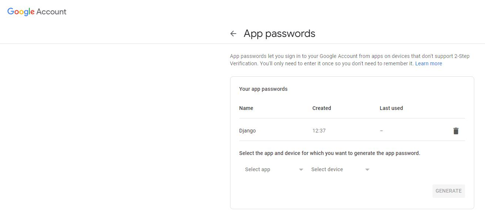

- Click create and a 16 digit password will be generated, note the password down
- In the env.py file, create an environment variable called EMAIL_HOST_PASS with the 16 digit password
- In the env.py file, create an environment variable called EMAIL_HOST_USER with the email address of the gmail account
- Set and confirm the following values in the settings.py file to successfully send emails

 ```django
    EMAIL_BACKEND = 'django.core.mail.backends.smtp.EmailBackend'
    EMAIL_USE_TLS = True
    EMAIL_PORT = 587
    EMAIL_HOST = 'smtp.gmail.com'
    EMAIL_HOST_USER = os.environ.get('EMAIL_HOST_USER')
    EMAIL_HOST_PASSWORD = os.environ.get('EMAIL_HOST_PASS')
    DEFAULT_FROM_EMAIL = os.environ.get('EMAIL_HOST_USER')
 ```

- You will also need to set the variables EMAIL_HOST_PASS and EMAIL_HOST_USER in your production instance, for example Heroku

## Stripe

- Register for an account at [stripe.com](https://stripe.com/en-ie)
- Click on the Developers section of your account once logged in
- Under Developers, click on the API keys section
- Note the values for the publishable and secret keys

  

- In your local environment(env.py) and heroku, create environment variables STRIPE_PUBLIC_KEY and STRIPE_SECRET_KEY with the publishable and secret key values

  ```django
  os.environ.setdefault('STRIPE_PUBLIC_KEY', 'YOUR_VALUE_GOES_HERE')
  os.environ.setdefault('STRIPE_SECRET_KEY', 'YOUR_VALUE_GOES_HERE')
  ```

- Back in the Developers section of your stripe account click on Webhooks
- Create a webhook with the url of your website /checkout/wh/, for example: [https://mx-monster.herokuapp.com/checkout/wh/](https://mx-monster.herokuapp.com/checkout/wh/)
- Select the payment_intent.payment_failed and payment_intent.succeeded as events to send
- Note the key created for this webhook
- In your local environment(env.py) and heroku, create environment variable `STRIPE_WH_SECRET with the secret values os.environ.setdefault('STRIPE_WH_SECRET', 'YOUR_VALUE_GOES_HERE')`
- Test the webhook and note the success/fail attempts for troubleshooting, see events and logs for further testing.

## Amazon WebServices

- Create an account at aws.amazon.com

- Open the S3 application and create an S3 bucket named "mx-monster"

- Select AWS Region.


- Uncheck the "Block All Public access setting" & acknowledge that the bucket will be public, it will need to be public in order to allow public access to static files.


- In the Properties section, navigate to the "Static Website Hosting" section and click edit
- Under the Properties section, turn on "Static Website Hosting", and set the index.html and the error.html values.


- In the Permissions section, click edit on the CORS configuration and set the below configuration


- In the permissions section, click edit on the bucket policy and generate and set the below configuration(or similar to your settings)


- Go to the Access Control List and set the List objects permission for everyone under the Public Access section.
- Open the IAM application to control access to the bucket and set up a user group called
- Click on Policies, and Create Policy.
- Click on the JSON tab and import a pre-built Amazon policy called AmazonS3FullAccess:
- Set the following settings in the JSON tab:
- Click Review Policy, give it a name and description and click Create Policy.
- To attach the policy to the group, navigate to Groups, then Permissions, and under Add Permissions, select Attach Policy.
- To create a user for the group, click Add User, and create one
- Add the user to the group created, making sure to download the CSV file which contains the user's access credentials.
- Note the following AWS code in Settings.py. An environment variable called USE_AWS must be set to use these settings, otherwise it will use local storage:


## Deployment

- This project was developed using a GitPod workspace. The code was committed to Git and pushed to GitHub using the terminal.
- Log in to [Heroku](https://www.heroku.com/) or create an account
- On the main page click New and Create New App
- Note: new app name must be unique
- Next select your region
- Click Create App button
- Click in resources and select Heroku Postgres database
- Click Reveal Config Vars and add new config "SECRET_KEY"
- Click Reveal Config Vars and add new config "DISABLE_COLLECTSTATIC = 1"
- The next page is the project’s Deploy Tab. Click on the Settings Tab and scroll down to Config Vars
- Next, go to Buildpack section click Add Buildpack select python and Save Changes
- Scroll to the top of the page and choose the Deploy tab
- Select Github as the deployment method
- Confirm you want to connect to GitHub
- Search for the repository name and click the connect button
- Scroll to the bottom of the deploy page and select the preferred deployment type
- Click either Enable Automatic Deploys for automatic deployment when you push updates to Github
- As Heroku Student Pack no longer includes free access to the Postgres add-on I had to migrate Postgres databases from Heroku to ElephantSQL.
- Navigate to [ElephantSQL](https://www.elephantsql.com/) and click “Get a managed database today”
- Select “Try now for FREE” in the TINY TURTLE database plan
- Select “Log in with GitHub” and authorize ElephantSQL with your selected GitHub account
- In the Create new team form:
  - Add a team name
  - Read and agree to the Terms of Service
  - Select **Yes** for GDPR
  - Provide your email address
  - Click **Create Team**

### Migrating databases

- Log in to ElephantSQL.com to access your dashboard
- Click **Create New Instance**
- Set up your plan
- Select **Select Region** EXAMPLE "EU-West-1 (Ireland)"
- Then click **Review**
- Check your details are correct and then click **Create instance**
- Return to the ElephantSQL dashboard and click on the database instance name for this project

### Migrating your data

- Navigate to the [Postgres Migration Tool](https://github.com/Code-Institute-Org/postgres-migration-tool) on github in a new browser tab
- Click the Gitpod button to open a new workspace
- Run the script `python3 reel2reel.py` command in the terminal
- In a different browser tab, go to your app in Heroku and select the Settings tab
- Click the **Reveal Config Vars** button
- Copy the value in the DATABASE_URL Config Var. It will start with postgres://
- Return to Gitpod and paste in the URL you just copied into the terminal where prompted to provide your DATABASE_URL and click enter
- In your original browser tab, get your ElephantSQL database URL. Again, it will start with postgres://
- Return to Gitpod and paste in the URL where prompted
- The data will now be downloaded from Heroku and uploaded to your ElephantSQL database
- To test that your database has been moved successfully, return to ElephantSQL and select BROWSER
- Click the **Table queries** button. If you see any options in the dropdown, your tables have been created
- Select a table name you recognise, and then click **Execute**
- You should see your data displayed relating to the table you selected

### Connecting ElephantSQL database to Heroku

- In the Heroku Dashboard for your project, open the Resources tab
- In the Resources tab, remove the existing Postgres add-on:
- Confirm by typing in the name of your Heroku app when prompted.
- Navigate to the Settings tab
- Reveal your existing Config Vars. The original DATABASE_URL should have been deleted when the add-on was removed.
- Add a new config var called DATABASE_URL and paste in the value for your ElephantSQL database, and click Add to save it.
- Check the Activity tab to confirm

### Final Deployment

- Create a Procfile web: gunicorn mx_monster.wsgi:application
- When development is complete change the debug setting to: DEBUG = os.environ.get('DEBUG')
- Add os.environ.get('DEBUG') in env.py
- In Heroku settings, delete the config vars for DISABLE_COLLECTSTATIC = 1

### Forking This Project

By forking the GitHub Repository you will be able to make a copy of the original repository on your own GitHub account allowing you to view and/or make changes without affecting the original repository by using the following steps:

- Log in to GitHub and locate the [GitHub Repository](https://github.com/kwalczak80/mx-monster)
- Find the "Fork" button at the top right of the page
- You should now have a copy of the original repository in your GitHub account.

### Cloning This Project

Clone this project by following the steps:

- Open [GitHub](https://github.com/kwalczak80/mx-monster)
- You will be provided with three options to choose from, HTTPS, SSH or GitHub CLI, click the clipboard icon in order to copy the URL
- Once you click the button the fork will be in your repository
- Open a new terminal
- Change the current working directory to the location that you want the cloned directory
- Type 'git clone' and paste the URL copied in step 3
- Press 'Enter' and the project is cloned

## Technologies Used

### Languages

- [HTML](https://en.wikipedia.org/wiki/HTML)
- [CSS](https://en.wikipedia.org/wiki/CSS)
- [JavaScript](https://en.wikipedia.org/wiki/JavaScript)
- [Python](https://en.wikipedia.org/wiki/Python_(programming_language))
- [Jinja](https://jinja.palletsprojects.com/en/3.0.x/templates/)
- [Markdown](https://en.wikipedia.org/wiki/Markdown)

### Python Libraries

- asgiref==3.5.2
- boto3==1.26.1
- botocore==1.29.1
- dj-database-url==0.5.0
- Django==3.2
- django-allauth==0.41.0
- django-countries==7.2.1
- django-crispy-forms==1.14.0
- django-storages==1.13.1
- gunicorn==20.1.0
- jmespath==1.0.1
- oauthlib==3.2.1
- Pillow==9.2.0
- psycopg2-binary==2.9.5
- python3-openid==3.2.0
- pytz==2022.4
- requests-oauthlib==1.3.1
- s3transfer==0.6.0
- sqlparse==0.4.3
- stripe==4.2.0

### Database

- Sqlite
  - This database was used in local development.
- PostgreSQL
  - The site is deployed on Heroku using a Postgress database.

### Frameworks

- Django
  - The project uses Django as the main framework.
- Boostrap 4
  - Used for general site layout.

### Programs and Tools

- [Heroku](https://id.heroku.com/login)
  - The project is deployed and hosted by Heroku.
- [Balsamiq](https://balsamiq.com/)
  - Used to create the website wireframes.
- [GitHub](https://github.com/)
  - GitHub was used to store all the project files written in Gitpod.
- [Gitpod](https://www.gitpod.io/)
  - Gitpod was used as a development environment.
- [AWS](https://aws.amazon.com/)
  - To store static files for the project
- [Drawsql](https://drawsql.app/)
  - Drawsql was used to design database model for the project.
- [W3School](https://www.w3schools.com/)
  - For problem solving and code searching.
- [Stack Overflow](https://stackoverflow.com/)
  - For problem solving and code searching.
- [Font Awesome](https://fontawesome.com/)
  - Font Awesome was used to add icons that represent links to social media.
- [CI Python Linter](https://pep8ci.herokuapp.com/)
  - For checking python convention.
- [Picture resizer](https://picresize.com/)
  - Picture resizing tool
- [CCS Gradient](https://cssgradient.io/)
  - Gradient generator
- [EZGIF](https://ezgif.com/)
  - Online GIF maker and image editor

## Credits

Throughout the process of building this project, various online sources have been used to help fix bugs & tackle problems, in addition to multiple modules to create the functionality of this website:

- [Boutique Ado](https://learn.codeinstitute.net/courses/course-v1:CodeInstitute+EA101+2021_T1/courseware/eb05f06e62c64ac89823cc956fcd8191/3adff2bf4a78469db72c5330b1afa836/)
  - Boutique Ado - from Code Institute
- [Stack Overflow](https://stackoverflow.com/)
  - To find solutions to the issues I encountered while creating this project.
- [W3Schools](https://www.w3schools.com/)
  - Additional source of knowledge.
- [Udemy](https://www.udemy.com/)
  - Various tutorials related to Django, Javascript and Python.
- [Business Opening hours card](https://bootsnipp.com/snippets/5K3o7)
  - To create the business opening hours card with the current day of the week.
- [Motorcycle Shop](https://www.motorcycleshop.ie/contactabout-1-w.asp)
  - To create the text content on the About page


## Content

- [FC Moto](https://www.fc-moto.de/) 
  - Product images
- [Privacy Policy Generator](https://policymaker.io/privacy-policy/)
  - To generate the privacy policy for MX Moster store.
- [Terms and Conditions Generator](https://policymaker.io/terms-and-conditions/)
  - To generate the terms and conditions for MX store.


## Acknowledgments

- My Mentor [Simen Eventyret](https://github.com/Eventyret) mentor for continuous helpful feedback.
